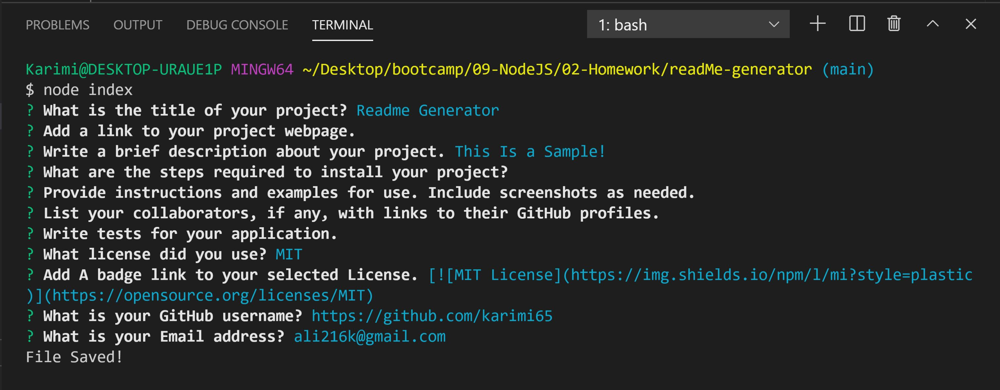

# ReadMe Generator

  

  ---
  ## Description
   Creating a command-line application that dynamically generates a professional markdown README file from a user's input using the Inquirer package.

  [link to video](https://drive.google.com/file/d/1fKS2tMofPym1Kpziffv2MhgYo6qrcmpy/view?usp=sharing)

  ---
  ## Table of Content
  * [Installation](#Installation)

  * [Usage](#Usage)

  * [Credits](#Credits)

  * [Test](#Test)

  * [License](#License)

  * [Question](#Question)

  ---
  ## Installation:
   
  

  ---
  ## Usage:
  
   You can quickly and easily create a README file by using a command-line application to generate one. This allows the project creator to devote more time to working on the project.

   

  ---
  ## Credits:
  
  

  ---
  ## Test:
  
  

  ---
  ## License:
  MIT
  

  --- 
  ## Question?
  If you have any question or require any further information, feel free to contact me. 

  GitHub: https://github.com/karimi65

  Email: ali216k@gmail.com
